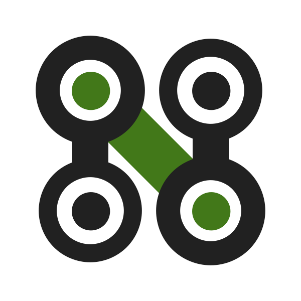
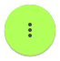
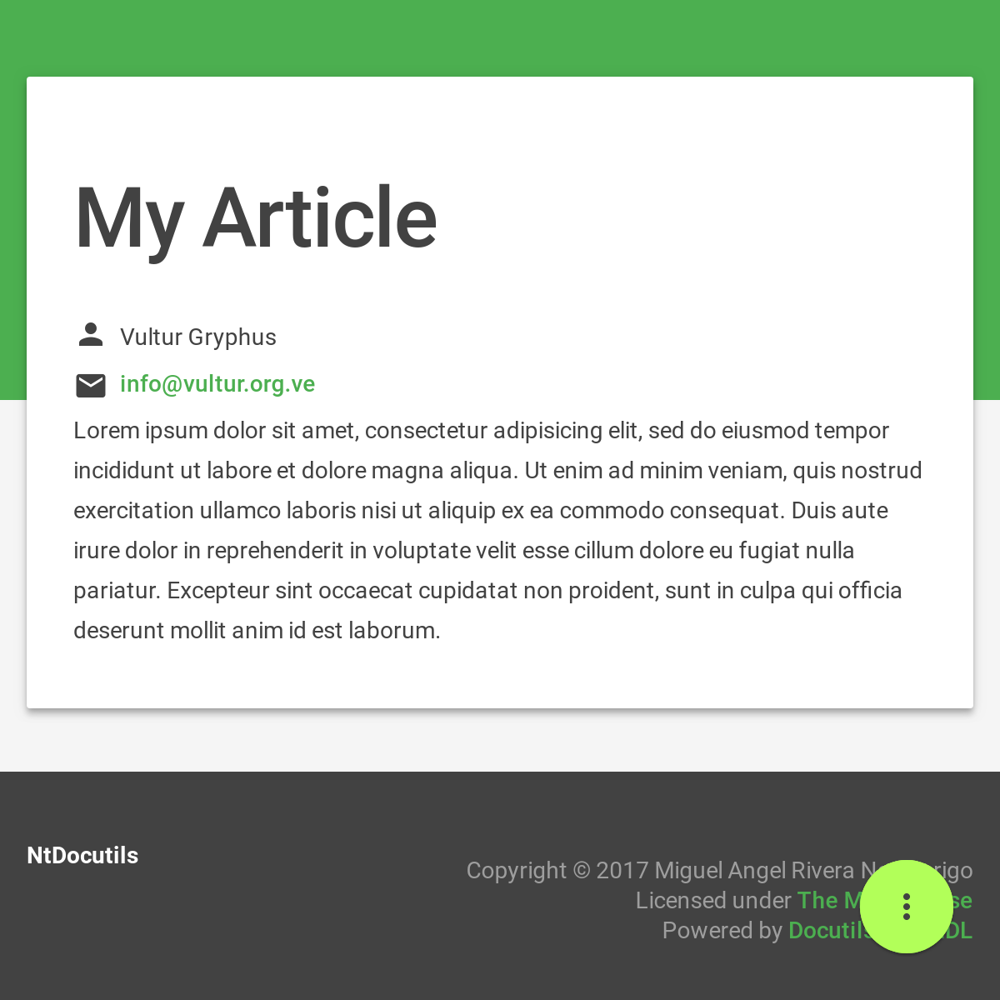
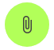
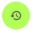

.. role:: emoji
.. role:: kbd

.. role:: css(code)
    :language: css

=========
MDL Theme
=========

-----
1.0.0
-----

:Author: Miguel Angel Rivera Notararigo
:Contact: `@ntrrg <https://nt.web.ve>`_
:Date: 2018-06-21T00:30:00-04:00
:License: `MIT <https://github.com/ntrrg/ntdocutils-theme-mdl/blob/v1.0.0/LICENSE>`_

.. _MDL: https://getmdl.io/
.. _Docutils: http://docutils.sourceforge.net/
.. _NtDocutils: https://nt.web.ve/en/projects/ntdocutils
.. _Demo site: demo.html

__ MDL_

This is a `Material Design Lite`__ theme for NtDocutils_. This page was built
with it, so you can see what is possible to do, but if you want to see all the
styles, checkout the `demo site`_.

.. contents::

Features
========

__ demo.html#emojis-and-keyboard-keys

* `Special roles`__ for emojis and keyboard keys.

__ `Filtering`_

* Filter content by OS, distributions, categories or any other filters you
  want (see `this section`__).

__ Attachments_
__ Translations_
__ Versions_

* `Attachments`__, print button, `translations`__ and `versions`__ linking  and
  more from the |options-button| button.

__ Printing_
__ Responsiveness_

* `Print friendly`__ and `responsiveness`__.

__ `Theme customization`_

* `Customizable`__.

Install
=======

**Requirements:**

* Python >= 3.4

.. code:: shell-session
    :class: fl fl-linux

    $ pip install ntdocutils-theme-mdl==1.0.0

.. code:: doscon
    :class: fl fl-windows

    C:\> pip install ntdocutils-theme-mdl==1.0.0

Usage
=====

Basically, you have to do two things:

#. Create a ``.rst`` file:

   ``example.rst``:

   .. include:: example.rst
       :code: rest

#. Process your file:

   .. code:: shell-session
       :class: fl fl-linux

       $ ntdocutils -T mdl example.rst example.html

   .. code:: doscon
       :class: fl fl-windows

       C:\> ntdocutils -T mdl example.rst example.html

And that's it, you already have some like this:

.. raw:: html

    <object data="example.html" type="text/html" height="400px" width="100%"
        class="media-screen">
    </object>

Filtering
---------

You can filter content just adding the ``fl fl-{{ filter name }}`` classes in
the elements you want filter, **NtDocutils** will create the buttons
dynamically at the left bottom corner and set the first filter that it finds
as default. E.g:

.. code:: rest

    .. class:: fl fl-linux

    **Text for Linux**

    .. class:: fl fl-windows

    **Text for Windows**

Will result in:

.. class:: fl fl-linux

**Text for Linux**

.. class:: fl fl-windows

**Text for Windows**

And creates two buttons at the bottom left corner with the filters names.

Attachments
-----------

You can set a list of useful files in the |attachments-button| button by
adding the following lines in the article:

.. code:: rest

    .. raw:: html

        

.. admonition:: Syntax
    :class: syntax

    ``ATTACHMENTS`` is a global array, it store the files list showed in the
    |attachments-button| button, each file must be defined as an object with
    the following properties:

    ``url`` (string)
      URL to the file.

    ``name`` (string)
      **Optional**. Name displayed at the list, also overwrites the attachment
      name.

    __ https://material.io/icons/

    ``icon`` (string)
      **Optional**. `Material icon`__ displayed at the list, by default this
      theme uses an icon related to the file extension.

    .. code:: text

        .. raw:: html

            

Translations
------------

You can link article translations in the |lang-button| button by adding the
following lines in the article:

.. code:: rest

    .. raw:: html

        

.. admonition:: Syntax
    :class: syntax

    ``LANGS`` is a global array, it store the translations list showed in the
    |lang-button| button, each translation must be defined as an object with
    the following properties:

    ``url`` (string)
      URL to the translation page.

    ``name`` (string)
      Name displayed at the list.

    .. code:: text

        .. raw:: html

            

Versions
--------

You can link article versions in the |versions-button| button by adding the
following lines in the article:

.. code:: rest

    .. raw:: html

        

.. admonition:: Syntax
    :class: syntax

    ``VERSIONS`` is a global array, it store the versions list showed in the
    |versions-button| button, each version must be defined as an object with
    the following properties:

    ``url`` (string)
      URL to the version page.

    ``name`` (string)
      Name displayed at the list.

    .. code:: text

        .. raw:: html

            

Printing
--------

There are some special classes that let you improve the way your article is
printed when something goes wrong; for example, some content doesn't fit at the
page or simply can't be showed as it should in paper. These classes are:

* :css:`.media-screen`: shows the element just in a screen.
* :css:`.media-print`: shows the element just in paper.

**Examples:**

* White spaces for paper (useful for ensure printing format):

.. code:: rst

    .. Page break

    .. |pb| raw:: html

        

    .. Line break

    .. |lb| raw:: html

         

* Display content for specific device:

.. code:: rst

    .. Screen

    .. raw:: html

        <object data="example.html" type="text/html" height="400px"
            width="100%" class="media-screen">
        </object>

    .. Paper

    .. image:: images/example.png
        :class: media-print

Responsiveness
--------------

With responsiveness classes is easy to improve how the article is viewed in
different sized screens, just use ``large-screen`` and ``small-screen`` when
you want it work, try it, resize the window.

.. code:: text
    :class: large-screen

    ##########################
    # LARGE SCREEN DETECTED! #
    ##########################

.. code:: text
    :class: small-screen

    ##########################
    # SMALL SCREEN DETECTED! #
    ##########################

.. code:: rst

    .. code:: text
        :class: large-screen

        ##########################
        # LARGE SCREEN DETECTED! #
        ##########################

    .. code:: text
        :class: small-screen

        ##########################
        # SMALL SCREEN DETECTED! #
        ##########################

Theme customization
-------------------

__ https://getmdl.io/customize/
__ attachments/customize.css

You can use the `customize tool`__ from the MDL_ site to get a custom
``.css`` with your preferred colors, after that, you must setup some styles
by creating a file with the following template__:

``customize.css``

.. code:: css
    :number-lines:

    /* Ribbon */

        .ribbon {
            background-color: {{ Primary color }};
        }

    /* ... */

.. code:: css
    :number-lines: 83

    /* ... */

    /* Links */

        /*a {
            color: {{ Accent color }};
        }*/

    /* ... */

The recommended color for the ribbon background (line 4) is the primary color
from the theme, you can get this value searching the property ``color`` at the
rule ``.mdl-button.mdl-button--colored`` in the file downloaded from MDL_
(``material.min.css``). The links (line 88) use the accent color from the
theme, but in some cases this make them a little unreadable, so you could
uncomment it and use the primary color. You should feel free editing the others
rules, but usually they will be fine with that values. When you are ready, you
have to run **NtDocutils** with the following option:

.. code:: shell-session
    :class: fl fl-linux

    $ ntdocutils -T mdl \
        --stylesheet=path/to/material.min.css,path/to/customize.css \
        source.rst destination.html

.. code:: doscon
    :class: fl fl-windows

    C:\> ntdocutils -T mdl \
           --stylesheet=path/to/material.min.css,path/to/customize.css \
           source.rst destination.html

Uninstall
=========

.. code:: shell-session
    :class: fl fl-linux

    # pip uninstall ntdocutils-theme-mdl

.. code:: doscon
    :class: fl fl-windows

    C:\> pip uninstall ntdocutils-theme-mdl

Acknowledgment
==============

Working on this project I use/used:

* `Debian <https://www.debian.org/>`_

* `XFCE <https://xfce.org/>`_

* `Sublime <ext 3](https://www.sublimetext.com/3>`_

* `Chrome <https://www.google.com/chrome/browser/desktop/index.html>`_

* `Terminator <https://gnometerminator.blogspot.com/p/introduction.html>`_

* `Zsh <http://www.zsh.org/>`_

* `Git <https://git-scm.com/>`_

* `EditorConfig <http://editorconfig.org/>`_

* `Github <https://github.com>`_

* `Inkscape <https://inkscape.org/en/>`_

* `GIMP <https://www.gimp.org/>`_

* `Material Icons <https://material.io/icons/>`_

* `Roboto <https://fonts.google.com/specimen/Roboto>`_

* `RawGit <https://rawgit.com/>`_

* `st <https://st.suckless.org/>`_

* `GNU Screen <https://www.gnu.org/software/screen>`_

* `Vim <https://www.vim.org/>`_

* `Gogs <https://gogs.io/>`_

**Docutils Team.** *reStructuredText.* http://docutils.sourceforge.net/rst.html

**Mozilla Developer Network.** *JavaScript.* https://developer.mozilla.org/en-US/docs/Web/JavaScript

.. raw:: html

    

